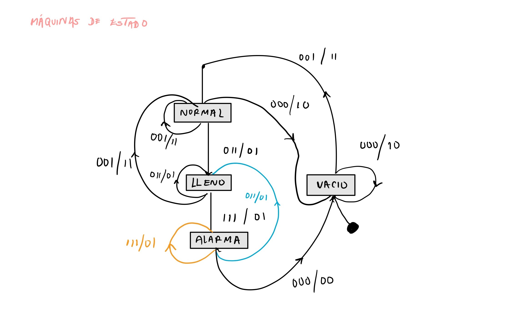
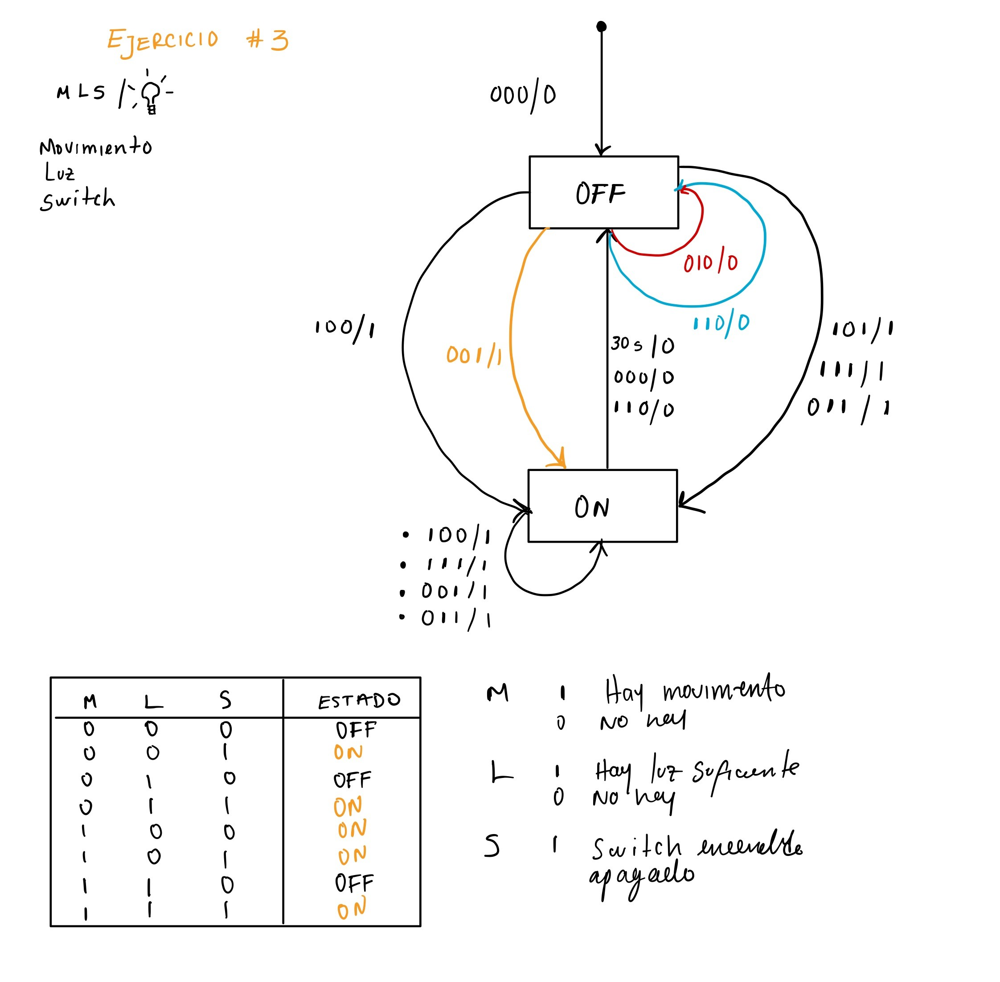

## Respuesta al Ejercicio 1

### Planteamiento de la Solución

Para abordar el problema, se diseñan dos **Máquinas de Estados Finitos (MEF)** que interactúan entre sí para cumplir el objetivo:

1. **MEF 1: Manejo del Pulsador con Antirrebotes**
   - **Estados**:
     - `IDLE`: Estado inicial, sin interacción detectada.
     - `PRESSED`: Detecta el pulsador presionado.
     - `RELEASED`: Detecta que el pulsador ha sido liberado y estabilizado.
   - **Propósito**: Garantizar que las señales del pulsador sean válidas, evitando los efectos del rebote eléctrico.

2. **MEF 2: Control del LED**
   - **Estados**:
     - `LED_OFF`: El LED está apagado.
     - `LED_ON`: El LED está encendido.
   - **Propósito**: Cambiar el estado del LED según la señal confirmada por la MEF de antirrebotes.

### Descripción de la Interacción

- La MEF 1 valida los eventos del pulsador y notifica un cambio de estado válido a la MEF 2.
- La MEF 2 utiliza esta información para alternar entre encender y apagar el LED.

### Ejemplo de Implementación

```c
// Definición de estados
typedef enum { IDLE, PRESSED, RELEASED } ButtonState;
typedef enum { LED_OFF, LED_ON } LedState;

// Variables de estado
ButtonState buttonState = IDLE;
LedState ledState = LED_OFF;

// Función para la MEF de Antirrebotes
void MEF1_Antirrebotes() {
    switch (buttonState) {
        case IDLE:
            if (pulsadorPresionado()) buttonState = PRESSED;
            break;
        case PRESSED:
            if (validarRebote()) buttonState = RELEASED;
            break;
        case RELEASED:
            if (!pulsadorPresionado()) buttonState = IDLE;
            break;
    }
}

// Función para la MEF de Control del LED
void MEF2_ControlLED() {
    static bool pulsadorProcesado = false; // Para evitar cambios múltiples por un solo pulso

    switch (ledState) {
        case LED_OFF:
            if (buttonState == RELEASED && !pulsadorProcesado) {
                ledState = LED_ON;
                pulsadorProcesado = true;
            }
            break;
        case LED_ON:
            if (buttonState == RELEASED && !pulsadorProcesado) {
                ledState = LED_OFF;
                pulsadorProcesado = true;
            }
            break;
    }

    if (buttonState == IDLE) pulsadorProcesado = false; // Reset al soltar el pulsador

    actualizarLED(ledState == LED_ON);
}

// Bucle principal
void loop() {
    MEF1_Antirrebotes();
    MEF2_ControlLED();
}
```

## Problema

Un tanque de agua abierto por la parte superior dispone de tres sensores de detección de llenado (**A**, **B**, **C**) que determinan 4 posibles niveles de llenado: **VACÍO**, **NORMAL**, **LLENO** y **ALARMA**. 

El nivel del tanque se controla mediante dos válvulas:  
- **E (Entrada):** Controla el ingreso de agua al tanque.  
- **S (Salida):** Controla la salida de agua del tanque.  

### Condiciones de Funcionamiento
1. **Nivel Normal:** Ambas válvulas (**E** y **S**) se encuentran **abiertas**.
2. **Nivel Vacío:** La válvula **S** se **cierra** y la válvula **E** se mantiene **abierta**.
3. **Nivel Lleno:** La válvula **E** se **cierra** y la válvula **S** se mantiene **abierta**.
4. **Nivel Alarma:** Ambas válvulas cambian:
   - **E** se **cierra**.
   - **S** se **abre**.  
   Este estado se mantiene hasta que el tanque vuelva al nivel de vacío.

### Datos Adicionales

El funcionamiento en máquinas de estado de los sensores y las válvulas se encuentra representado en la siguiente imagen:



## Ejercicio 3

### 1️⃣ **Sistema de Iluminación Inteligente 💡**

### **Descripción del Problema**

Se debe implementar un sistema que controle una lámpara en función de sensores de presencia, luz y un interruptor manual, siguiendo las condiciones descritas. 

### **Solución**

1. Se utilizó un **diagrama de estados** para representar la FSM, detallando las transiciones y condiciones para el control de la lámpara.
2. Se determinó que una FSM de tipo **Moore** es más adecuada, ya que las salidas dependen solo del estado actual.
3. La implementación puede realizarse mediante un microcontrolador que gestione los sensores, el interruptor y el control de la lámpara.




